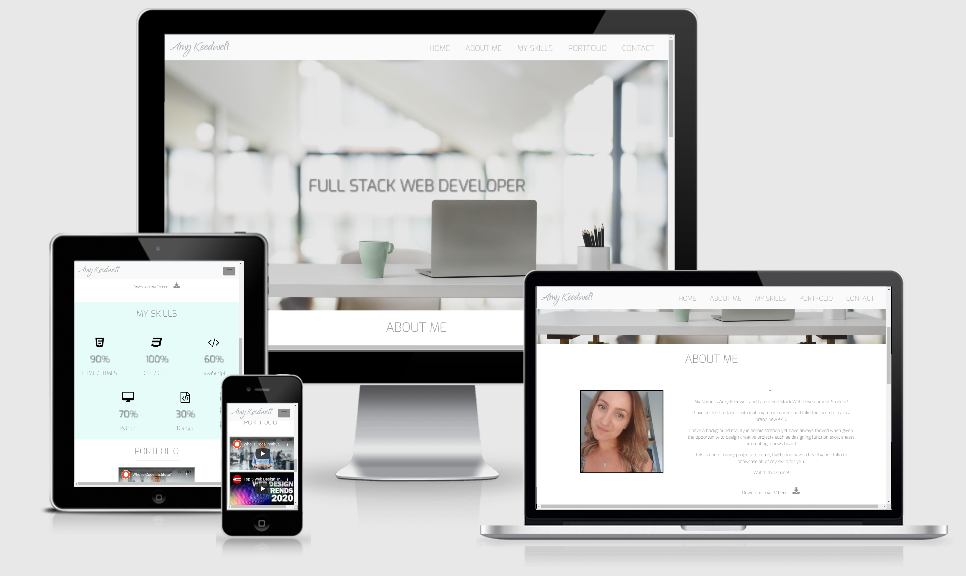

# My First Milestone Project - My Resume

A website created for the purpose of exhibiting my capability and skill in HTML and CSS. The website is aimed at future employers or colaborators to find out more about me on my journey to become a web developer. 

This is intended to be added to as I progress through the course, I will replace the example portfolio items with my work once I start to build up my own portfolio to showcase my skills.

You can find out anything you need to know about me in my quest into the world of Web Development. 
I have shared some brief information about my employment history and my next adventure into a new career. 
I have listed my skills including programming languages I am yet in learn in further modules to come. 
There is a section ready for me to fill with a portfolio of my work as I progress, I intend to expand this section alot!
I have included a form to get in touch with me to find out further information or just to have a friendly web development chat. 
I finised the page off with a footer reinforcing my name and what I do, followed by links to useful social media. 

My page is hosted on GitHub pages and respository on GitHub. 

[Click here to view My Project](https://amykeedwell.github.io/Milestone-Project-Resume/)

[Click here to view my Repository](https://github.com/AmyKeedwell/Milestone-Project-Resume)

# UX

This project is aimed at future employers and colaborators. The resume itself showcases my skills so far and will document my progress as I learn more coding languages and expand my portfolio. 

## User Stories
* An employer seeking a junior developer.

* Another developer seeking someone to colaborate with on a project or simply find out more!

* An employer seeking to download my Resume.

* To view my current skill levels.

* View links to my up and coming portfolio.

* Anyone who is interested to get to know more about me.

* To get in touch with me, either to discuss job opportunities, a collaboration or even a general chat.

* To locate my social media to reach out to me.

## Mockups
* I created two different mock-ups, one initally using balsamiq wireframes then with Figma. 

* I changed my idea completely from my initial wireframe, changing the design to a one page scrollable site to make it look more modern.

    * [Initial Figma Wireframe](https://www.figma.com/file/lavYTEY7B2frKxxIN4XMjM/Resume-Wireframe?node-id=0%3A1)

    * [Final Figma Wireframe](https://www.figma.com/file/Rgv2pMbPDQQhSOYDuhGjwm/Untitled?node-id=0%3A1)

* *Only a few aspects have changed since my final wireframe:*
    * *I chose to use a hover effect rather than an animation for the 'My Skills' section, I hope to add the animation once I have progressed my skills during the next JavaScript Module.*
    * *I moved the location of the map in the 'Contact Me' section to below my information and form as these parts should be the main focus of this section.*

# Design
* The colour scheme consists of complementary colours which were inspired by the colours in my header image and give the site a bright and clean feel. 
    * I have used a combination of a light grey (#f1f1f1) and a mint green (#e5fcf8).

* [Exo](https://fonts.google.com/specimen/Exo?query=exo) font used throughout all text.
* [Qwigley](https://fonts.google.com/specimen/Qwigley?query=qwigley) font used for my header name to draw in attention.

# Features
* **Header** containing my name and a smooth scroll navbar to navigate the one scrolling page style website.

    * Hero Image of a desk containing the text "Full Stack Web Developer" to clearly show what this website is about.

* **About me** section containing a brief description of me containing information about my background and what I am hoping to achieve. 
    * This also contains a link to download my resume.

* **Skills** section containing a selection of the skills I have learnt and am yet to study. These have interactive skill percentages which will be updated as I progress.

* **Portfolio** section which will eventually showcase my upcoming projects and work. At present I have added videos about coding, one of which is a video about Code Institute for anyone who is also looking to take a career change.

* **Contact Me** section provides a form for anyone to get in touch, this will become interactive later in my course.   
    * There are contact details such as phone/email/ address below this followed by google maps of the area. 

* **Social links** are available in the footer alongside a link to download my resume. 

## Features left to implement
* I initially intended to add an animation to the skills section but found after researching that this mainly requires JavaScript - a skill I am yet to learn so will update this when I can. 
    * Instead, opted to add a hover effect to my skills to make the section feel more interactive. 

* A functional form where you can contact me. 

# Technologies Used
This project makes use of:
* [HTML](https://developer.mozilla.org/en-US/docs/Web/HTML)
    * HTML for structure.
* [CSS](https://developer.mozilla.org/en-US/docs/Web/CSS)
    * CSS for Styling.
* [Google Chrome](https://www.google.com/chrome/)
    * Used for browser and dev tools.
* [Google](https://www.google.co.uk/)
    * Google was used for research.
* [Google Fonts](https://fonts.google.com/)
    * Used for typogrphy
* [Bootstrap](https://getbootstrap.com/)
    * HTML and CSS Framework, Grid System - Columns and Rows from Bootstrap.
* [Font Awesome](https://fontawesome.com/)
    * Used to add icons throughout the page.
* [Balsamiq Wireframes](https://balsamiq.com/wireframes/)
    * Used to make initial wireframe.
* [Figma](https://www.figma.com/)
    * Used to make my final wireframe.
* [Git](https://git-scm.com/)
    * Git used for Version Control.
* [GitHub](https://github.com/)
    * Repository hosted on GitHub.
* [Github Pages](https://amykeedwell.github.io/Milestone-Project-Resume/)
    * Website hosted on Github Pages.
* [Am I Responsive](http://ami.responsivedesign.is/)
    * Testing responsiveness of the website.
* [HTML Validator](https://validator.w3.org/)
    * Validated HTML code by direct input to check for any errors.
* [CSS Validator](https://jigsaw.w3.org/css-validator/)
    * Validated CSS code by direct input to check for any errors.
* [HTML Formatter](https://www.freeformatter.com/html-formatter.html#ad-output)
    * Checked that HTML code is formatted and indented correctly.

# Testing
* Tested responsiveness using google dev tools. I tested the following types:

    * iPhone 5/SE (portrait: 320x568 & landscape: 568x320)
    * Galaxy S5/Moto G4 (portrait: 360x640 & landscape: 640x360)
    * iPhone 6/7/8 (portrait: 375x667 & landscape: 667x375)
    * iPhone X (portrait: 375x812 & landscape: 812x375)
    * Pixel 2 (portrait: 411x731 & landscape: 731x411)
    * Pixel 2 XL (portrait: 411x823 & landscape: 823x411)
    * iPhone 6/7/8 Plus (portrait: 414x736 & landscape: 736x414)
    * iPad (portrait: 768x1024 & landscape: 1024x768)
    * iPad Pro (portrait: 1024x1366 & landscape: 1366x1024)

* Attempt to submit form without filling in all sections correctly to check that a pop up stops the form from being submitted incorrectly.

* Tested the navbar links to each section of the site to ensure they smoothly scroll to the correct section of the page, checked as horizontal navbar and dropdown menu.

* Tested the link to download my Resume on PC/Mobile to ensure this works correctly. 

* Checked responsiveness of hover effect in skills section which works by hovering the mouse on PC and clicking on the %'s on mobile devices.

* Loaded my website on different browsers:
    * Google Chrome - I created my site whilst viewing on Chrome, I believe it works seemlessly on this browser.
    
    * Samsung S9 - Sent myself GitHub Pages link and checked functionality, no problems found all sections looked balance and loaded correctly, all links functional.
    * Samsung S10 - Sent my partner GitHub Pages link and checked functionality, no problems found all sections looked balance and loaded correctly, all links functional, it was noted that my Header Text 'Full Stack Web Developer' was blending into the background image but this was down to the phone being set to Dark Mode.
    * iPad - Sent my family the link to test functionality and get feedback
        * One issue flagged was that the navbar doesn't retract once a nav item has been clicked on - I aimed to fix this but couldn't find a solution without using JavaScript. 
        * One issue was that the social links in the footer were not centering on smaller screens. I changed the alignment and fixed this issue by removing the float class and centering the text. 
    
        **Bugs Found**:
        * Internet Explorer - Found that the portoflio videos do not center, I have spent alot of time googling a solution but still unsure on how to fix this, tried adding 'margin:0 auto;' to the CSS but no luck so this is still an issue unfortunately. 
        * Safari - same issue with the videos sitting to the left on the page. Again googled solutions and added 'text-align: -webkit-center;' but this didn't seem to work. 

* Posted my code in the peer-code-review section on slack for fellow students to test and give any feeback and constructive criticism.
    * Still awaiting any replies!

* [Am I Responsive](http://ami.responsivedesign.is/?url=https://amykeedwell.github.io/Milestone-Project-Resume/)
    * Testing responsiveness of the website, found the page looked great on all screen sizes available.

* Code Validators to ensure my code is written in the correct format and there are no errors.
    * [HTML Validator](https://validator.w3.org/)
    * [CSS Validator](https://jigsaw.w3.org/css-validator/)

# Deployment
The project is hosted on GitHub Pages

The process involved:
* Host a git repository on GitHub.

* Create project in GitPod saving each big change for version control to GitHub.
* Open your project repository in GitHub.
* Click on settings.
* Scroll down to the GitHub Pages section.
* Click on source and select master branch.
* After the page refreshes you will have a link to your deployed website.
* Final product now hosted on GitHub Pages. 

To deploy your own version of the website:

* Have git installed

* Visit the repository
* Click 'Clone or download' and copy the code for http
* Open your chosen IDE (Cloud9, VS Code, etc.)
* Open a terminal in your root directory
* Type 'git clone ' followed by the code taken from github repository
* When this completes you have your own version of the website
* Feel free to make any changes to it
* The website can be run by opening one of the HTML files within a web browser
* Visit the link provided
* Your website with any made changes will appear
* Saved changes to the website will appear here after refreshing the page

The benefits of hosting your website on GitHub pages is that any pushed changes to your project will automatically update the website. Development branches can be created and merged to the master when complete.

It may take a moment for changes to appear on the hosted website.

During development the site is written in VS Code. It is run using Live Server plugin for VS Code.

# Credits.
* Header photo taken from: https://www.pexels.com/search/desk/

* Inspiration for layout taken from browsing: https://www.free-css.com/free-css-templates

# Acknowledgements
* My mentor Seun Owonikoko for her guidance, advice and reference material. 

* Code Institute for teaching me the skills to create this site!